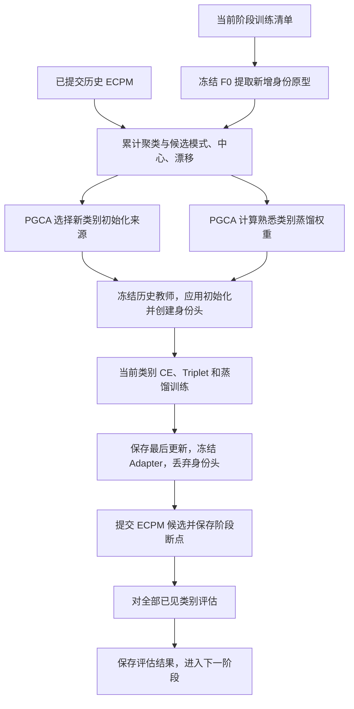

# ECPM 与 PGCA 技术手册

本文以当前仓库实际实现为准，适合先理解方法，再沿代码定位实现。公式中的类别、身份、阶段分别表示不同概念。
当前完整入口是 [train_category_progressive.py](E:/Multi_modal_Code/CVPR2026-VLADR-main/train_category_progressive.py)。

阅读建议：先读第 1—3 节建立整体认识，再读第 4—6 节的两个模块与损失，最后查阅流程、参数、代码和实验说明。

## 1. 先用两句话理解两个模块

**ECPM：演化式聚类类别原型记忆。** 把每个训练身份的图片压缩成一个特征摘要；再把相似身份归为若干模式，概括类别的外观分布。历史摘要持续保留，供后续学习和测试路由使用。

**PGCA：原型引导的类别自适应。** 根据 ECPM 提供的统计，决定如何学习：熟悉类别继续训练自己的 Adapter，并用旧模型约束当前特征；陌生类别先判断能否借用某个历史类别的 Adapter 参数作为起点。

| 部分 | 可以怎样理解 | 实际产物 |
|---|---|---|
| ECPM | 给各类别维护一本会不断补充的外观笔记 | 身份原型、模式原型、类别原型、旧快照、漂移 |
| PGCA 熟悉类别分支 | 学习新身份时，参考自己过去的处理方式 | 冻结教师、蒸馏损失、阶段内固定的蒸馏权重 |
| PGCA 陌生类别分支 | 新类别先挑一个合适的历史学习起点 | 来源选择和独立复制的新类别 Adapter |
| 原型硬路由 | 测试时根据图片外观选择类别 Adapter | 类别预测和最终检索特征 |

ECPM 主要是**统计与记忆更新**，没有自己的反向传播损失。PGCA 则影响**参数初始化与训练损失**。测试硬路由使用 ECPM 的原型；PGCA 已通过训练影响 Adapter 参数，测试时不需要教师网络。

## 2. 本项目到底在解决什么任务

### 2.1 类别可以再来，同一训练身份不会跨阶段再来

以两阶段为例：

```text
T1：person {a, b}，vehicle {a, b}
T2：person {c, d}，panda {a, b}
```

T2 的 person 是熟悉类别，但 c、d 是第一次参与训练的新身份。panda 的类别和身份都第一次出现。
person:a 与 vehicle:a 是不同身份；默认完整身份键为 `(category, source_dataset, original_pid)`，必要时由配置中的身份别名归并同一真实身份。

当前真实阶段安排：

| 阶段 | 当前参与训练的类别 | 首次出现类别 | 再次出现类别 | 已见但本阶段缺席 |
|---|---|---|---|---|
| T1 | person、vehicle | person、vehicle | 无 | 无 |
| T2 | person、panda、tiger | panda、tiger | person | vehicle |
| T3 | vehicle、panda、person | 无 | vehicle、panda、person | tiger |
| T4 | tiger、boat、vehicle | boat | tiger、vehicle | person、panda |

这里的“熟悉”依据历史类别登记判断，不依据某张图片的路由得分判断。训练期间知道类别和身份标签。

### 2.2 当前是阶段式增量学习

一个阶段开始时，程序可以遍历该阶段的完整训练图像，为新身份建立原型，再训练本阶段。它不是每来一张图就立刻在线更新一次的逐样本流。

原型准备只读取当前阶段训练图片；历史阶段依赖已经保存的原型，后续阶段图片不提前用于特征提取。数据流审计可以检查完整清单的元数据。
旧训练图像不进入后续阶段的训练或原型提取；阶段评估会按协议重复读取固定测试/验证集，这与旧训练图像回放不同。

### 2.3 测试中的“未知”是什么意思

正式评估时，不把图片的类别交给路由器；路由器在**所有已见类别**中选择 Adapter。评估身份与训练身份分开。
因此当前任务是：**已见类别中的未见身份检索，推理不提供类别标签**。

例如 T1 的正式评估只包含 person 和 vehicle，不评估尚未到来的 panda。当前没有未见类别拒识，也没有“判断这张图片属于一个全新类别”的开放集机制。

数据定义与加载见 [category_stream.py](E:/Multi_modal_Code/CVPR2026-VLADR-main/lreid_dataset/category_stream.py)、[category_stream_loaders.py](E:/Multi_modal_Code/CVPR2026-VLADR-main/lreid_dataset/category_stream_loaders.py)。

## 3. 两个模块依赖的基础模型

### 3.1 一套冻结主干，多个持久类别 Adapter

当前使用本地 CLIP ViT-B/16 的视觉主干，只保留视觉分支。默认图像输入为 224×224，输出投影后 CLS 特征维度为 512。
预处理使用当前 `ReferenceConfig`，工厂默认是 pad resize 与代码中指定的均值/标准差；不能在中途随意换成其他 CLIP 预处理。

每个类别在 ViT 最后 4 个 Transformer block 中各有一个 Adapter，瓶颈维度默认 64。可以把一整套类别 Adapter 记作 \(A_c\)，参数记作 \(\theta_c\)。

Adapter 是 MLP 残差旁支。一个带 Adapter 的 block 可概括为：

\[
u=h+\operatorname{Attention}(\operatorname{LN}_1(h)),\qquad
h'=u+\operatorname{MLP}(\operatorname{LN}_2(u))
       +A_c(\operatorname{LN}_2(u)).
\]

其中 \(A_c(v)=s[W_{up}\,\operatorname{QuickGELU}(W_{down}v+b_{down})+b_{up}]\)，默认 \(s=1\)。
默认初始化把上投影的权重和偏置置零，因此新 Adapter 的残差输出初始为零；下投影仍有随机初始化。

类别再次出现时，继续使用原来的 \(\theta_c\)。类别缺席时，它的 Adapter 不更新。实现中共享冻结主干，不为每个类别永久保存一份完整 ViT。

### 3.2 两种前向传播，承担不同工作

| 记号 | 含义 | 代码入口 | 用途 |
|---|---|---|---|
| \(F_0(x)\) | 冻结主干，关闭所有类别 Adapter | `encode_reference(images)` | ECPM 原型、测试路由 |
| \(F_c(x;\theta_c)\) | 同一冻结主干，启用类别 c 的 Adapter | `encode_category(images, category)` | CE、Triplet、蒸馏、最终检索特征 |

`encode_reference` 禁用梯度与 AMP，输出原始 FP32 投影 CLS 特征。`encode_category` 允许梯度通过冻结 block 传回 Adapter；“主干不更新”不等于可以对整个类别前向使用 `no_grad`。

当前身份分类头是独立线性层，仅覆盖“当前阶段、当前类别”的训练身份。阶段结束后丢弃；下一次该类别到来时建立新头。类别 Adapter 持久保留，身份分类头不持久保留。

模型实现见 [category_adapter_bank.py](E:/Multi_modal_Code/CVPR2026-VLADR-main/reid/models/category_adapter_bank.py)，Adapter 旁支见 [CLIP 模型实现](E:/Multi_modal_Code/CVPR2026-VLADR-main/reid/models/CLIP_ReID/model/clip/model.py) 中的 `DomainAdapter` 与 `ResidualAttentionBlock.forward`。

## 4. ECPM：具体存什么，怎样更新

以下用 \(\operatorname{Norm}(v)=v/\|v\|_2\) 表示 L2 归一化。实现会拒绝非有限或近零的原型均值。

### 4.1 身份原型：先把一个身份压缩成一个向量

某个身份 i 在到达阶段的训练图片集合为 \(\mathcal X_i\)，其原型为：

\[
p_i=\operatorname{Norm}\left(\frac{1}{|\mathcal X_i|}
\sum_{x\in\mathcal X_i}F_0(x)\right).
\]

大白话：同一身份有很多张图，先让冻结参考编码器看完这些图，再取一个平均外观摘要。
实现是**先平均原始特征，再归一化**，不是先把每张图片的特征归一化再平均。
提取使用固定参考变换，每张当前训练图片恰好访问一次；不按 P×K 训练采样器重复抽样。

每个身份持久保存：`identity_key`、512 维 FP32 `vector`、`image_count`、`first_stage`。
身份记忆不保存图像、路径或逐图片特征，当前阶段清单仍由数据加载部分持有。

相关代码：[ecpm.py](E:/Multi_modal_Code/CVPR2026-VLADR-main/reid/memory/ecpm.py) 中的 `IdentityPrototypeAccumulator.add/finish`、`IdentityPrototypeMemory.prepare_stage`。

### 4.2 模式原型：把同类中相似身份归组

类别 c 再次到来时，汇合这个类别的全部历史身份原型与当前新增身份原型，用 FINCH 聚类。
一个模式可能概括相近外观，但程序没有给模式标注“红衣服”“某种车型”等语义，不能把聚类结果直接当作已验证的语义属性。

当前实现：

- 使用 `finch-clust==0.2.3` 的官方 `clust_rank/get_clust`。
- 以余弦距离查找非自身最近邻，分块计算精确最近邻。
- 仅使用 FINCH 的第一层划分，代码记为 `partition=0`。
- 身份先按完整身份键排序；距离相同按这一顺序打破平局。
- 类别只有一个身份时，直接形成一个模式。

设第 k 个簇的身份集合为 \(\mathcal I_{c,k}^{t}\)，模式原型为：

\[
g_{c,k}^{t}=\operatorname{Norm}\left(
\frac{1}{|\mathcal I_{c,k}^{t}|}\sum_{i\in\mathcal I_{c,k}^{t}}p_i\right).
\]

每个身份等权参与所属模式的均值，不按该身份图片数量加权。
类别再次更新时会对累计身份原型重新聚类；模式数量和簇归属可以变化，簇编号不是跨阶段固定的语义标签。

### 4.3 类别原型：对模式等权平均

若类别 c 有 \(K_c^t\) 个模式：

\[
m_c^t=\operatorname{Norm}\left(\frac{1}{K_c^t}
\sum_{k=1}^{K_c^t}g_{c,k}^t\right).
\]

注意三个平均层次：图片在身份内平均；身份在模式内平均；模式在类别内平均。
最后一层是**模式等权**，不是按每个簇的身份数加权。
例如两个簇分别有 20 个和 2 个身份，两个模式向量在类别均值中仍各占一半。
这种设计让少数模式保有影响力，也可能使小簇噪声更显著，是否有益需要消融验证。

模式聚合与漂移实现见 [finch_modes.py](E:/Multi_modal_Code/CVPR2026-VLADR-main/reid/memory/finch_modes.py) 中的 `aggregate_modes`、`build_category_modes`、`finch_first_partition`。

### 4.4 漂移：旧类别概括与加入新身份后的概括相差多少

熟悉类别的漂移定义为：

\[
d_c^t=1-\cos(m_c^{old},\widetilde m_c^t),\qquad d_c^t\in[0,2].
\]

\(m_c^{old}\) 来自已提交的历史记忆；\(\widetilde m_c^t\) 来自“历史身份原型 + 当前新增身份原型”的候选聚类。
因此这里不是单独把“旧身份集合中心”与“当前新身份集合中心”比较。

F0 一直冻结，所以该漂移反映的是**累计身份集合及聚类概括的变化**，不是 Adapter 训练前后特征变化。
新类别没有旧中心，其漂移记录为 `None/null`，不当作数值 0 传给熟悉类别控制分支。

### 4.5 先准备候选，训练结束再正式提交

`ECPMMemory.prepare_stage` 在训练前准备当前候选，保留：

```text
old_categories     所有已提交历史类别的独立快照
rows               当前阶段新增身份原型
category_updates   当前类别累计聚类后的模式、中心
drifts             当前熟悉类别的漂移；新类别为 None
```

PGCA 可以读取候选，但正式记忆尚未改变。阶段训练成功后，`commit_stage` 才提交这些原型和聚类结果。
由于原型来自冻结 F0，阶段训练不会改变它们，阶段结束无需再用训练后的 Adapter 重算原型。

完整状态管理见 [ecpm_modes.py](E:/Multi_modal_Code/CVPR2026-VLADR-main/reid/memory/ecpm_modes.py)。
旧身份原型持续保留，缺席类别的正式模式/中心保持不变；当前实现没有身份原型淘汰或固定容量预算。

## 5. PGCA：两种类别，两种学习方式

### 5.1 熟悉类别：保留原 Adapter，加上特征蒸馏

以 T2 的 person 为例。学生继续使用 T1 训练过的 person Adapter；在任何本阶段更新之前，另存一个冻结的历史教师快照。
教师包含历史主干和 Adapter 银行，前向只服务于需要蒸馏的熟悉类别，不参与优化。

取一张 T2 新身份的当前训练图像 x，学生和教师看到**同一张已增强的图像张量**：

\[
f_s=F_c(x;\theta_c),\qquad
f_{old}=F_c(x;\theta_c^{old}),
\]

\[
\mathcal L_{con,c}^t=\frac{1}{B_c}\sum_{x\in\mathcal B_c}
\left[1-\cos\big(f_s,\operatorname{stopgrad}(f_{old})\big)\right].
\]

大白话：新模型在学习新身份时，还要尽量保留旧模型对这些当前图片的特征表达方式。
教师不需要以前见过这些新身份；它只提供特征参照。

这不是重放旧图片，不要求 T1、T2 有相同身份，也不是对旧身份分类 logits 做 KL 蒸馏。
教师启用了历史类别 Adapter；它与“关闭所有 Adapter 的参考编码器 F0”不是同一种前向。

漂移控制权重为：

\[
w_c^t=\lambda_{con}\exp(-\gamma d_c^t).
\]

漂移越大，权重越小，允许当前类别有更大适应空间；漂移越小，权重越接近 \(\lambda_{con}\)。
该权重在阶段准备时算好，在整个阶段内固定，不是每个 batch 重新估计。
新类别、`consistency=off` 或零权重不执行对应教师前向。

实现分工：

- [adaptation/pgca.py](E:/Multi_modal_Code/CVPR2026-VLADR-main/reid/adaptation/pgca.py)：`FrozenCategoryTeacher`、`RecurringCategoryConsistency`，创建教师、校验候选、缓存权重。
- [loss/pgca.py](E:/Multi_modal_Code/CVPR2026-VLADR-main/reid/loss/pgca.py)：`consistency_weight` 与 `FeatureConsistencyLoss`，计算权重和 FP32 余弦蒸馏损失。

### 5.2 陌生类别：按相似性选择历史 Adapter 初始化

以 T2 的 panda 为例。它第一次出现，没有自己的历史 Adapter。
PGCA 比较 panda 的候选原型与阶段开始前所有历史类别的原型，决定是否借用某个历史 Adapter 作为初值。

新类别 c 与历史类别 h 的相似度为：

\[
s(c,h)=\alpha\cos(\widetilde m_c^t,m_h^{old})
 +(1-\alpha)\frac{1}{K_c^t}\sum_{k=1}^{K_c^t}
 \max_{1\le j\le K_h^{old}}\cos(\widetilde g_{c,k}^t,g_{h,j}^{old}).
\]

第一项比较整体类别中心；第二项让新类别的每个模式，在历史类别里找一个最相近模式，再对新类别模式平均。
第二项是**从新类别到历史类别的有方向覆盖**，一般不等于反方向分数，也不是两边全部模式两两平均。

选取 \(h^*=\arg\max_h s(c,h)\)，然后：

\[
\theta_c^{init}=\begin{cases}
\operatorname{copy}(\theta_{h^*}^{old}),&s(c,h^*)\ge\delta,\\
\theta_{default},&\text{没有历史类别或未达到阈值}.
\end{cases}
\]

分数相同按类别排序选择；阈值包含等号。`alpha` 是全局与模式相似度的权重，**不是两个 Adapter 参数的混合比例**。
当前实现选择一个来源，不融合多个来源。

重要边界：

- 候选来源包含全部历史类别，即使来源类别当前缺席。
- 同阶段首次出现的两个类别不能互相当历史来源。例如 T2 的 panda、tiger 都只能从 T1 历史里选来源。
- 所有来源参数在当前训练前独立快照，避免读取本阶段已经更新过的来源。
- 新类别获得参数的独立复制，之后自行训练，不与来源共享可训练参数。
- 不复制来源身份分类头；新类别建立自己的当前身份头。
- 初始化完成后，不对来源类别持续蒸馏，也不在每轮重新选择来源。
- T1 没有历史来源，person 与 vehicle 都采用默认初始化。

实现见 `prototype_similarity`、`select_transfer_source`、`PrototypeGuidedInitialization`。
阶段日志 `initialization.decisions` 记录 `selected_source`、`best_score`、`reason` 等字段。
配置为 `similarity` 不等于一定发生了迁移，必须检查是否达到阈值。

## 6. 最终训练目标是什么

每个当前类别独立组织 P×K batch，临时身份头只区分当前类别当前阶段的身份。
CE 用原始投影特征经线性头产生 logits；Triplet 使用归一化后的特征，正负样本均取自同类别 batch。

\[
\mathcal L_{tri,c}=\frac{1}{B_c}\sum_i
\left[\max_{j:y_j=y_i,j\ne i}\|\bar f_i-\bar f_j\|_2
-\min_{j:y_j\ne y_i}\|\bar f_i-\bar f_j\|_2+\mu\right]_+,
\quad \bar f=\operatorname{Norm}(f).
\]

\[
\mathcal L_c=\mathcal L_{CE,c}+\lambda_{tri}\mathcal L_{tri,c}
 +w_c^t\mathcal L_{con,c},\qquad
\mathcal L_{step}=\sum_{c\in\mathcal C_t}\mathcal L_c.
\]

新类别的 \(w_c^t=0\)。当前类别的各项损失先在各自 batch 内平均，再对类别求和；实现没有再除以当前类别数量。
每次更新，每个当前类别各取一个 batch，依次前向/反向，最后做一次共享 AdamW 更新。
这不是跨类别构造 Triplet，也不是以 ECPM 的身份原型直接作为分类器权重。

默认 `batch_size=32, num_instances=4`，即每类别每次抽 8 个身份、每身份 4 张图。当前有两个类别时，一次更新共处理 64 张训练样本。
`epochs=10, iterations_per_epoch=100` 表示每阶段 1000 次更新，不保证每个 epoch 完整遍历所有图片。

实现见 [trainer_category_progressive.py](E:/Multi_modal_Code/CVPR2026-VLADR-main/reid/trainer_category_progressive.py) 的 `_backward_batches/_train_batches`，以及 [category_triplet.py](E:/Multi_modal_Code/CVPR2026-VLADR-main/reid/loss/category_triplet.py)。
AMP 溢出时降低倍率并重试同一批次，只有成功更新才推进有效步数；持续数值异常仍报错。

## 7. 一个完整阶段按什么顺序执行



关键调用顺序：

```python
# 流程伪代码，不是可直接执行的脚本
candidate = memory.prepare_stage(model, stage)
trainer = ResumableCategoryTrainer(
    model, stage, loaders, config,
    ecpm_memory=memory, ecpm_candidate=candidate,
    consistency=consistency_config, initialization=transfer_config,
)
while stage_has_remaining_updates:
    trainer.train_step()
    save_checkpoint_at_configured_interval()
trainer.finish_stage()
memory.commit_stage(candidate)
save_boundary_checkpoint(pending_evaluation=True)
evaluate_stage(model, memory, stream, stage_id)
save_results_and_checkpoint()
```

构造 trainer 时，先准备初始化决策和来源快照，再建立熟悉类别教师，之后才真正应用初始化、创建身份头和优化器。
流程入口的 `prepare_stage / commit_stage / evaluate_pending_stage` 对应这三个主要阶段。

## 8. 测试时如何使用两个模块的产物

给定图片 x，先提取参考特征 \(z=\operatorname{Norm}(F_0(x))\)。
对每个已见类别打分：

\[
r_c(x)=\beta\cos(z,m_c)+(1-\beta)\max_k\cos(z,g_{c,k}),
\qquad \hat c(x)=\arg\max_c r_c(x).
\]

再使用选中的类别 Adapter：

\[
f(x)=\operatorname{Norm}(F_{\hat c(x)}(x;\theta_{\hat c(x)})).
\]

大白话：先由参考主干判断更像哪个已见类别，再由该类别 Adapter 生成区分身份的特征。
这是硬选择，不是对多个 Adapter 特征加权融合。query 和 gallery 的每张图片分别路由；不把 query 的类别强行套给 gallery。
实际 `RoutedEncoder.__call__` 只接受图像张量，内部按预测类别分组前向并恢复原 batch 顺序。

身份检索最后比较 query 与 gallery 的描述子相似度，不是去 ECPM 中查询旧训练身份原型。
正式单张描述子通常涉及一次 F0 前向和一次选中 Adapter 前向；评估还另外计算 oracle 特征，所以评估耗时不等于纯正式推理耗时。

路由实现见 [prototype_router.py](E:/Multi_modal_Code/CVPR2026-VLADR-main/reid/evaluation/prototype_router.py)。
`oracle` 直接使用真实类别选 Adapter，是诊断对照，不是未见类别测试，也不是数学上的性能上界。

## 9. 常用参数与消融怎么对应

以下默认值指完整入口 `train_category_progressive.py`。底层配置类的默认值可能是关闭/默认初始化，不能把底层默认与主入口默认混为一谈。

| 参数 | 主入口默认 | 控制的内容 |
|---|---|---|
| `--consistency` | `drift` | 熟悉类别蒸馏：off / fixed / drift |
| `--lambda-con` | 1.0 | 蒸馏基础权重 |
| `--gamma` | 1.0 | 漂移对权重的衰减强度 |
| `--init-mode` | `similarity` | 新类别初始化：default / similarity / random / source |
| `--alpha` | 0.5 | 迁移相似度中全局中心的权重 |
| `--delta` | 0.5 | 相似性初始化接受阈值 |
| `--control-summary` | `ecpm` | PGCA 使用模式原型统计还是 identity_mean 简化视图 |
| `--routing-summary` | `ecpm` | 测试路由使用哪种统计视图 |
| `--beta` | 0.5 | 测试路由中类别中心的权重 |
| `--finch-chunk-size` | 256 | 精确距离计算的分块行数，不是簇数量 |
| `--prototype-batch-size` | 128 | 阶段准备时参考特征提取批大小 |
| `--lambda-tri / --triplet-margin` | 1.0 / 0.3 | 基础身份学习的 Triplet 设置 |

`random` 是从历史类别中随机选来源的消融，使用局部确定性随机数；`source` 强制选定 `--transfer-source`，两者有历史来源时不依赖阈值决策。

| 想验证的内容 | 在相同完整训练命令中替换的参数 |
|---|---|
| 关闭整个 PGCA，保留 ECPM | `--consistency off --init-mode default` |
| 只关闭熟悉类别蒸馏 | `--consistency off --init-mode similarity` |
| 只关闭新类别迁移 | `--consistency drift --init-mode default` |
| 动态蒸馏对比固定蒸馏 | `--consistency fixed --init-mode similarity` |
| 简单中心路由 | `--routing-summary identity_mean` |
| 简单中心控制 PGCA | `--control-summary identity_mean` |

`identity_mean` 是所有累计身份原型直接等权平均后归一化，并把该中心作为唯一模式。
当前消融仍建立、保存完整 FINCH 记忆，只改变消费者使用的统计视图，不能据此声称省去了 FINCH 计算。
自动消融脚本的 `persistent_baseline` 同时关闭 PGCA 并切换两种统计视图，不等价于“仅关闭 PGCA”。

实现见 [prototype_views.py](E:/Multi_modal_Code/CVPR2026-VLADR-main/reid/memory/prototype_views.py)、[run_category_ablations.py](E:/Multi_modal_Code/CVPR2026-VLADR-main/tools/run_category_ablations.py)。
公平消融从相同参考权重、相同数据流与训练预算开始，各用独立输出目录；不能从完整模型最终断点出发再宣称移除了某模块。
参数选择用 validation，固定方案后报告 test 和多种随机种子结果。

## 10. 读代码与日志的定位表

| 问题 | 代码 / 对象 | 重点看什么 |
|---|---|---|
| 数据属于哪个阶段、身份是否重复 | `category_stream.py` 的 `CategoryStream/StageView` | new / recurring / absent 类别、身份键、清单审计 |
| 当前类别 batch 怎么抽 | `category_stream_loaders.py` 的 `CategoryIdentityBatchSampler` | P×K、epoch 种子、重复采样 |
| 身份原型怎么算 | `ecpm.py` 的 `IdentityPrototypeAccumulator` | FP32 原始特征求和、覆盖检查、归一化 |
| 模式、中心和漂移怎么算 | `finch_modes.py` | first partition、aggregate_modes、prototype_drift |
| 候选与正式记忆何时更新 | `ecpm_modes.py` 的 `ECPMMemory` | prepare_stage、validate_candidate、commit_stage |
| 新类别从谁初始化 | `adaptation/pgca.py` 的 `PrototypeGuidedInitialization` | selected_source、threshold、来源快照 |
| 旧教师是谁 | 同文件的 `FrozenCategoryTeacher` | 阶段开始快照、冻结、同一当前输入 |
| 权重和蒸馏怎么算 | `loss/pgca.py` | consistency_weight、FeatureConsistencyLoss |
| 各类别损失如何更新参数 | `trainer_category_progressive.py` | _backward_batches、_train_batches |
| 精确采样游标和状态如何恢复 | [trainer_category_resumable.py](E:/Multi_modal_Code/CVPR2026-VLADR-main/reid/trainer_category_resumable.py) | train_step、state_dict、from_state_dict |
| 正式测试有没有使用类别标签 | `prototype_router.py` 的 `RoutedEncoder` | 图像张量唯一输入、分组前向 |
| mAP 和 Rank1 怎么算 | [category_oracle.py](E:/Multi_modal_Code/CVPR2026-VLADR-main/reid/evaluation/category_oracle.py) | 稳定排序、同图/同相机过滤；函数虽名 oracle，但正式路由也复用该指标函数 |
| 阶段评估和遗忘矩阵 | [evaluation/category_progressive.py](E:/Multi_modal_Code/CVPR2026-VLADR-main/reid/evaluation/category_progressive.py) | evaluate_stage、lifelong_summary |

实验输出：

- `run_config.json`：实际参数、环境与代码指纹。先核对实际配置，再解释实验。
- `stage_0000.jsonl` 等：`stage_start` 中的 `initialization`、`pgca`；训练步的 CE、Triplet、consistency、consistency_weight、prototype_drift。
- `progress.jsonl`：stage_prepared / stage_committed / stage_evaluated 等生命周期事件。
- `evaluation.jsonl`、`evaluation_summary.json`：正式/诊断路由、原图库/混合图库、各类别指标与历史性能矩阵。
- 终端 `evaluation_progress`：特征提取批次、已计算 query 数、耗时与完成提示，不是持久断点状态。

如果只拿到 `evaluation_summary.json`，可以分析结果和 ECPM 漂移，但无法完整核实实际来源 Adapter 决策及蒸馏损失大小。

## 11. 断点与评估工程约束

`reference.pt` 保存冻结主干；`latest.pt` 保存适配器、ECPM、当前候选、训练中的身份头/优化器/scaler/教师、采样游标、RNG、评估历史和待评估标记。
训练中的临时对象会进入断点以便恢复，但不表示它们是部署所需的永久模块。

当前精确恢复要求 `workers=0`、相同环境/设备/线程与训练源码、相同数据配置、有效日志前缀。
恢复实现见 [progressive_checkpoint.py](E:/Multi_modal_Code/CVPR2026-VLADR-main/reid/utils/progressive_checkpoint.py) 与主入口。

阶段提交后会先保存 `pending_evaluation`。若评估被中断，恢复时重新执行尚未完成的评估，不重复已保存的训练更新。
评估中间特征没有持久缓存，重新评估仍需重新提取它们。

已修复的评估瓶颈：原来每个 query-gallery 配对都调用路径解析；现在在每次指标调用中每个样本只解析一次，并使用张量执行协议过滤。
这一实现保留原有分数、稳定排序与 AP 计算。输出进度只能证明已完成的工作在推进，不是独立定时心跳。

针对首次评估尚未完成的旧 T1 断点，有一次受限迁移工具，说明见 [评估提速与断点接续](E:/Multi_modal_Code/CVPR2026-VLADR-main/docs/fast_evaluation_recovery_zh.md)。
它不是通用跨版本恢复功能，也不允许任意忽略训练代码差异。

## 12. 当前结果说明了什么，还不能说明什么

用户首次 seed 42 真实实验的 T4 原图库正式路由结果：宏平均 mAP 54.07、Rank1 73.61，类别路由准确率约 99.91%。
oracle 宏平均 mAP 约 54.0777，与正式路由 54.0718 接近，说明本次路由错误对最终宏平均 mAP 的影响很小。
没有简单中心对照时，不能把高路由准确率全部归功于模式原型。

该实验熟悉类别漂移约 0.000175—0.001747，实际 `lambda_con=1, gamma=1`，因此蒸馏权重约 0.998255—0.999825。
动态调节幅度很小，接近固定权重。这不代表蒸馏本身没有作用，应先比较固定权重和关闭蒸馏，再判断是否需要校准漂移尺度。

还应明确以下限制：

1. 冻结参考空间让历史摘要可比较，但其类别中心可能对细粒度身份分布变化不够敏感；累计平均也可能淡化新增数据变化。这些是待验证的解释，不是已确认的唯一原因。
2. 类别独立 Adapter 冻结本身就能减少缺席类别的变化，不能把全部“没有遗忘”归因于 PGCA。
3. 漂移是全局类别中心差异，不是模式分布之间的完整距离。即使局部模式变化，中心也可能基本不变。
4. 全部历史身份原型保留，存储随身份数增长；精确 FINCH 最近邻搜索时间随单类别累计身份数呈二次增长，分块只控制距离工作内存。
5. 当前“遗忘”衡量固定留出身份测试集上历史最佳与当前性能之差，不直接度量旧训练身份的记忆。新加入类别会改变宏平均的组成。
6. 新类别初始化仅选择单个历史来源，其有效性要看实际选源记录、默认初始化和随机来源对照。

结果分析见 [首次真实实验解读](E:/Multi_modal_Code/CVPR2026-VLADR-main/docs/results_seed42_analysis_zh.md)。
测试通过证明实现和协议检查在已覆盖场景下成立；模块效果、相对优势与论文贡献仍需同协议基线和消融支撑。

## 13. 最容易混淆的十个问题

| 问题 | 当前实现的答案 |
|---|---|
| ECPM 是否保存旧图片？ | 身份记忆不保存旧图片，保存原型、身份键、数量与阶段信息。 |
| 原型是否来自训练后的类别 Adapter？ | 来自冻结 F0；类别 Adapter 不参与原型提取。 |
| 同一身份是否需要跨阶段出现？ | 不需要，当前协议明确禁止训练身份跨阶段重复。 |
| 熟悉类别教师输入旧图还是新图？ | 当前阶段新身份的图片，与学生使用同一已增强张量。 |
| 漂移是主干参数变化吗？ | 不是，是冻结空间中累计数据原型概括的变化。 |
| 模式原型是不是有真实属性标签？ | 没有，它是聚类得到的统计原型。 |
| alpha 是迁移参数插值系数吗？ | 不是，是全局相似度与模式相似度的组合系数。 |
| 一次初始化后还持续向来源蒸馏吗？ | 当前新类别分支没有这种额外蒸馏。 |
| oracle 是真正的自动路由吗？ | 不是，oracle 已知类别；正式结果看 prototype。 |
| 关闭 PGCA 是否就移除 ECPM 和所有 Adapter？ | 不是，off + default 只关闭 PGCA 的两个分支，基础结构和 ECPM 仍保留。 |

训练和消融命令的完整操作说明见 [Ubuntu 训练命令手册](E:/Multi_modal_Code/CVPR2026-VLADR-main/docs/ubuntu_training_commands_zh.md)。

每阶段的训练类别、累计已见类别、mAP、R1 与旧类别遗忘输出，见 [逐阶段结果使用说明](stage_reporting_usage_zh.md)。其中 `stage_results.md` 使用旧类别平均遗忘，新类别记为不适用；原始 `lifelong` 字段保持原来的统计口径。
